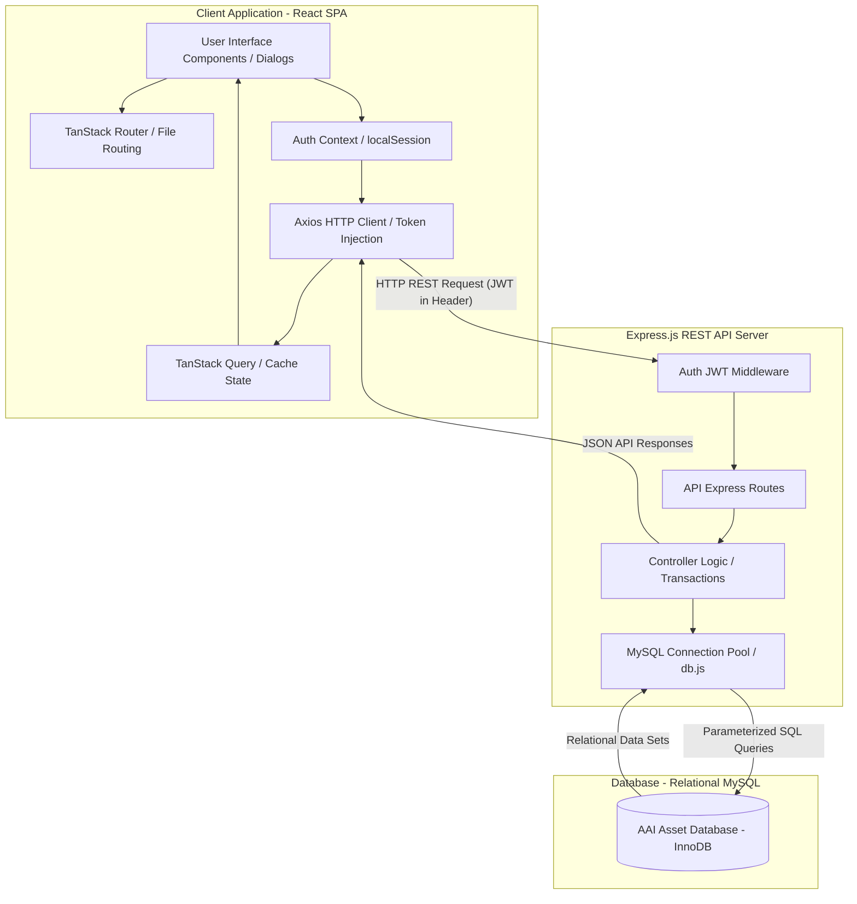
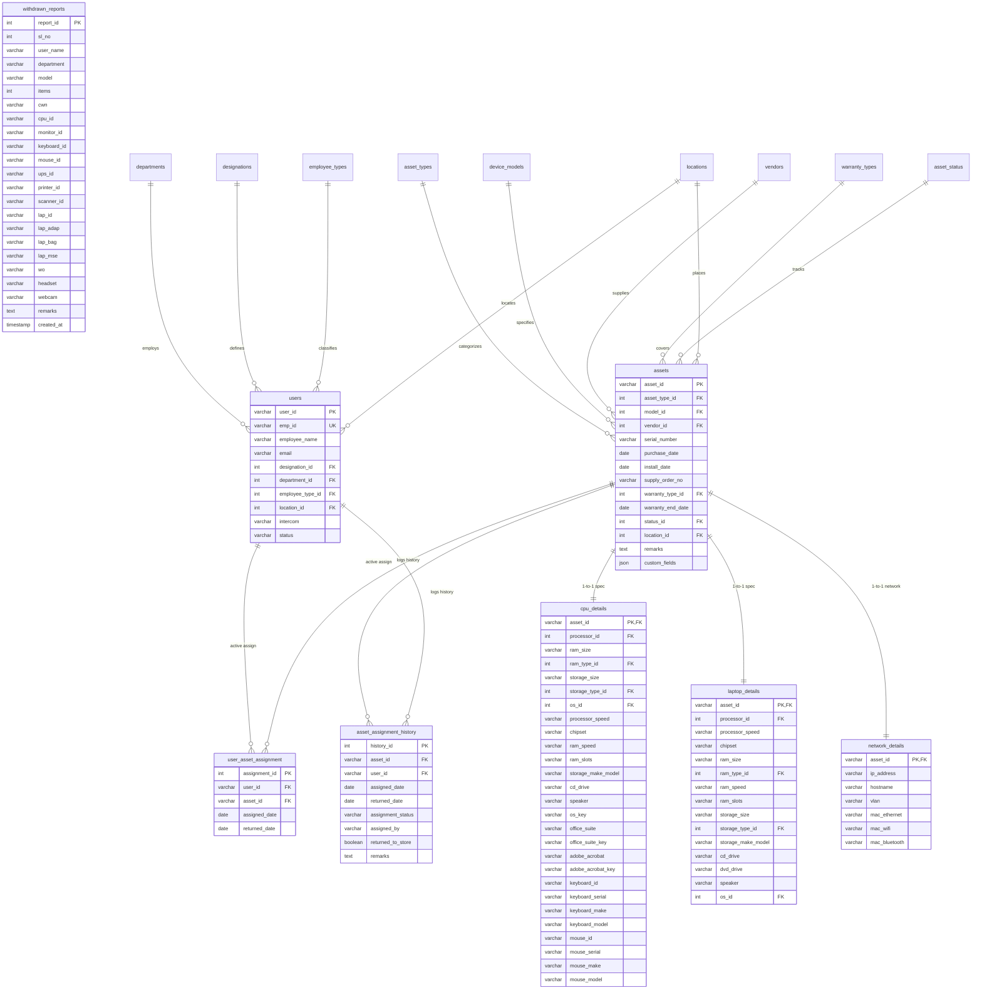
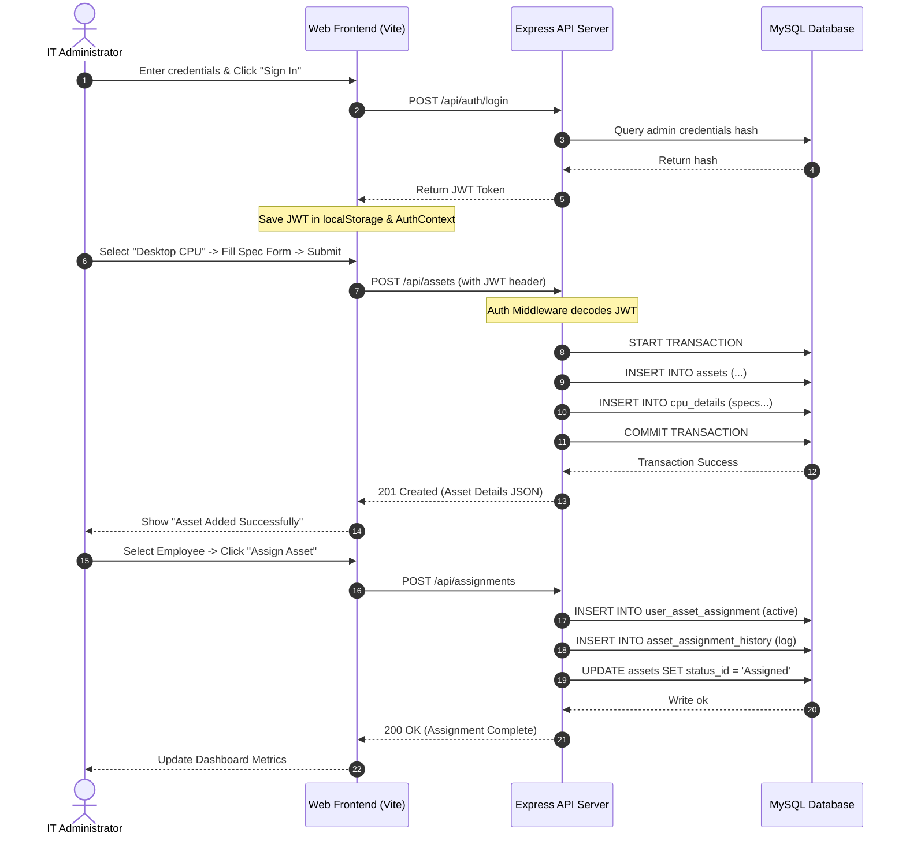

# AAI AssetFlow - IT Asset and Hardware Lifecycle Management System

An enterprise-grade IT Asset Management System developed for the **Airports Authority of India (AAI)** to manage, track, and audit organizational IT hardware, network resources, software licenses, and employee assignments through a centralized, secure web dashboard.

---

## Why AAI AssetFlow? (Rationale)

Airports and aviation facilities operate in high-security, high-availability environments. Managing IT assets (such as workstations, ATC terminal monitors, routers, and switches) in these settings using spreadsheets presents significant challenges:
* **No Normalization & Data Integrity:** Duplication of names, brand names, and locations leads to spelling errors and inconsistent reports.
* **Lack of Specifications Consistency:** A Desktop CPU requires columns like *RAM Slots, Mouse Serial, and Processor Speed*, while a Network Switch needs *IP Address, Hostname, and VLAN*. Spreadsheets result in countless sparse, `NULL`-heavy tables.
* **Audit Trails & Security:** IT hardware allocation must be strictly linked to active employees with complete transaction dates, return flags, and administrator logs to comply with government audit requirements.
* **Clearance and Exit Checklists:** When an employee leaves a station or retires, they must obtain a formal handover sign-off (withdrawal report) listing every asset returned to store.

**AAI AssetFlow** resolves these pain points by implementing a custom **3NF normalized relational schema** combined with a **dynamic type schema builder** to allow hardware specifications separation, strict **JWT-based authorization**, and a complete audit logger.

---

## Technology Stack

| Layer | Component | Description |
| :--- | :--- | :--- |
| **Frontend** | React 19 + TypeScript + Vite | Compiles into a fast, static Single Page Application (SPA). |
| **Routing** | TanStack Router | Type-safe declarative client-side route manager. |
| **State & API** | TanStack Query + Axios | Manages API fetch caching, pagination, and requests synchronization. |
| **Styling** | Tailwind CSS v4 + Shadcn UI | Curated dark/light theme options using CSS `oklch` variables. |
| **Backend** | Node.js + Express.js | Lightweight HTTP REST microservice API. |
| **Database** | MySQL 8.x | High-performance relational DB utilizing a thread-safe connection pool. |
| **Authentication**| JSON Web Tokens (JWT) | Secure stateless token-based auth with bcrypt password hashing. |

---

## System Architecture

The application is built on a decoupled, client-server model communicating over REST JSON interfaces:



---

## Database Design and ER Diagram (3NF)

To ensure zero redundant storage and prevent anomalies, lookup columns like `brands`, `locations`, `departments`, `asset_status`, `processors`, and `operating_systems` are fully isolated. Physical hardware specs are divided into dedicated spec-tables linked to the main `assets` table via 1-to-1 relationships.



### Key Normalization Practices in the Schema:
1. **Dynamic Extension via details Tables**: Rather than polluting the core `assets` table with specific configurations (like RAM speed or OS versions), those are stored in secondary 1-to-1 tables (`cpu_details`, `laptop_details`, `network_details`).
2. **Lookup Tables**: Attributes like `brands`, `device_models`, `locations`, `departments`, and `asset_status` are fully isolated into relational reference tables to avoid duplicate entries and typos.
3. **Audit Trail Logs**: The `asset_assignment_history` table keeps a permanent record of all current and historical assignments, noting parameters like returned status and active admins.

---

## System Interactions and Data Flow

This sequence chart outlines the transaction life-cycle when an administrator adds and allocates an asset:



---

## Project Directory Structure

```
aai-assetflow/
├── server/                     # Backend API Microservice
│   ├── controllers/            # SQL handlers & transactional business logic
│   ├── middleware/             # Authorization (JWT verify) layer
│   ├── routes/                 # Express API endpoints routing
│   ├── .env                    # Local database credentials
│   ├── create-table.js         # Migration: creates withdrawn_reports table
│   ├── db.js                   # MySQL Connection Pool initializations
│   ├── init-db.js              # Full database structure initializer
│   ├── migrate-custom.js       # Migration: schema updates for JSON custom fields
│   ├── migrate-indexes.js      # Migration: high-performance index builders
│   ├── schema.sql              # Relational tables configuration
│   ├── seed.sql                # Master lookups baseline entries
│   ├── seed-dummy.js           # Development sandbox seed file
│   └── server.js               # Express entrypoint
├── src/                        # Frontend Application
│   ├── components/             # Reusable React components & form modals
│   │   ├── ui/                 # Atomic design Radix/Shadcn primitives
│   │   ├── app-layout.tsx      # Sidebar, Themepersonalization, Nav bar
│   │   ├── asset-form-dialog.tsx # Dynamic Spec Form Wizard
│   │   └── user-form-dialog.tsx  # Employee profiles builder
│   ├── hooks/                  # Custom React hook helpers
│   ├── img/                    # Static assets & AAI logos
│   ├── lib/                    # Core configuration and helpers
│   │   ├── api.ts              # Axios instance configuration & error handlers
│   │   ├── auth-context.tsx    # AuthSession provider & JWT tracker
│   │   └── mock-data.ts        # Fallback offline simulation data
│   ├── routes/                 # File-based routing pages
│   │   ├── __root.tsx          # Root theme manager & global layout structure
│   │   ├── index.tsx           # Secured Login screen
│   │   ├── _app.tsx            # Protected router wrapper
│   │   ├── _app.dashboard.tsx  # Recharts aggregates & warranty warnings
│   │   ├── _app.credits.tsx    # AAI intern team carousel page
│   │   └── _app.withdrawals.tsx # Employee Exit handovers list & PDF generation
│   ├── styles.css              # Custom Tailwind directives & HSL tokens
│   ├── router.tsx              # TanStack Router instance
│   ├── server.ts               # SPA Server SSR compiler logic
│   └── start.ts                # App boot file
├── package.json                # Project dependencies and script runner configurations
├── vite.config.ts              # Vite configuration (plugins, paths resolution)
└── tsconfig.json               # TypeScript compiler options
```

---

## Folder and Key File Explanation

### Backend Server (`/server`)

| File/Folder | Purpose |
| :--- | :--- |
| `controllers/` | Execution of database queries. Houses logic for writing specs, auditing updates, and executing rollback procedures on SQL errors. |
| `routes/` | Receives incoming HTTP requests and directs them to correct controller handlers. |
| `db.js` | Uses `mysql2/promise` to export a pool of connections, avoiding database connection timeouts. |
| `schema.sql` | The database blueprint. Establishes primary keys, cascading foreign key constraints, and lookup indices. |
| `run_migration.js` | Sets up the authentication table `app_users` and seeds default credentials. |
| `migrate-custom.js` | Adds JSON schema functionality allowing dynamic custom attributes to be stored inside assets and asset types. |
| `migrate-indexes.js` | Safely adds database indices for search items (`serial_number`, `employee_name`) to speed up execution. |

### Frontend Application (`/src`)

| File/Folder | Purpose |
| :--- | :--- |
| `components/` | Shared UI components. `asset-form-dialog.tsx` handles complex form layout changes based on the selected Asset Type (Desktop specs vs Network specs). |
| `routes/` | Mapped directly to browser URLs via TanStack Router. File naming with prefix `_app.` enforces authentication check before rendering. |
| `lib/api.ts` | Configures Axios. Intercepts outgoing requests to append `Authorization: Bearer <token>`, and maps errors to client warnings. |
| `lib/auth-context.tsx` | Keeps track of who is logged in. Reads JWT contents, saves them in client browser session state, and redirects to login `/` if the token expires. |
| `styles.css` | Implements Tailwind rules and custom styling. Stores color palettes (`oklch`) for Dark and Light themes. |

---

## Clear Explanation of How It Works

### 1. Secured Authentication Lifecycle
When the application loads, `_app.tsx` intercepts the request to verify if the user possesses an active JWT in `localStorage`. If no token exists, the router redirects the browser to the login screen `/`.
* **Login Submit:** The user submits username and password. The backend hashes incoming passwords and compares them to database records via bcrypt.
* **Token Handshake:** On success, the backend returns a signed JWT containing username, role, and expiration timestamp.
* **Axios Interception:** The client Axios client (`api.ts`) catches the token. For every subsequent API call, it automatically appends the token in the `Authorization` header.

### 2. Dynamic Spec Form Rendering & Storage
Different asset types require completely different tracking structures. AAI AssetFlow handles this dynamically:
* **JSON Custom Schema:** The `asset_types` table contains a `custom_schema` column storing JSON definitions of expected attributes (e.g. `{ "cpu_speed": "text", "vlan": "number" }`).
* **Conditional Wizard Layout:** When an administrator opens the `asset-form-dialog.tsx` and selects an asset type:
  1. The UI queries the backend to retrieve that type's specifications structure.
  2. The form renders input elements matching the schema requirements.
* **Relational Storage Dispersal:** During insertion, the backend `assetsController.js` creates a MySQL transaction. It writes core information to the `assets` table, then splits secondary characteristics to write to specific specification tables (`cpu_details`, `laptop_details`, or `network_details`) using the shared `asset_id`.

### 3. Allocation and Audit Trails
An asset can exist in states like `Available`, `Assigned`, `Under Maintenance`, or `Disposed`.
* **Allocation:** When assigned to a user, the system updates `user_asset_assignment` with the date. It updates the asset status code to `Assigned`.
* **Auditing:** Concurrently, an entry is added to `asset_assignment_history` documenting who assigned the device, the date, and any remarks.
* **Release:** Returning the device sets the assignment `returned_date` to the current timestamp and updates the asset status back to `Available`.

### 4. Exit Clearance Withdrawal Certificates
When employees retire or transfer:
* **Retrieval Search:** Administrators open the exit clearance panel and search for the employee. The system aggregates all items currently assigned.
* **Clearance Submission:** The administrator processes the return of all hardware items.
* **withdrawn_reports Log:** A permanent sign-off sheet is created in the `withdrawn_reports` table documenting the return of specific serial numbers.
* **PDF Handover:** Using the client-side PDF template, administrators can export a print-ready Handover Certificate directly from the UI.

---

## Step-by-Step Blueprint: How It Was Made

### Phase 1: Relational Data Modeling (3NF)
1. Drafted the normalization layout. Mapped designations, locations, and departments to separate lookup tables with integer IDs to prevent textual redundancy.
2. Formulated 1-to-1 spec tables (`cpu_details`, `laptop_details`) to handle hardware configurations instead of using multiple `NULL` columns in a single table.
3. Created `schema.sql` to execute foreign key constraints with `ON DELETE RESTRICT` to prevent orphan records.

### Phase 2: Building the API Microservice
1. Initialized an Express app with `cors` and `express.json()` middlewares.
2. Created a connection pool configuration in `db.js`.
3. Coded the controllers using async/await patterns. Wrapped multitable modifications inside MySQL transactions:
   ```javascript
   await db.query('START TRANSACTION');
   // ... inserts ...
   await db.query('COMMIT');
   ```
4. Added JWT creation on the `/api/auth/login` route and verified it via header interceptors.

### Phase 3: SPA Client Configuration & Routes
1. Set up a Vite project configured with TanStack Router.
2. Established Tailwind styling variables to manage light, dark, and system themes.
3. Configured API paths in `api.ts` to map frontend fetch calls directly to the Express server port.

### Phase 4: Integration and Validations
1. Standardized input models. Implemented React Hook Form with Zod schemas to check inputs (like email formats and IP address structures) before sending them to the API.
2. Wired dashboard widgets to display dynamic Recharts visualizations using aggregates retrieved from the server.
3. Added the credits page carousel to introduce the AAI development team.

---

## How to Run and Verify Locally

### Prerequisites
* **Node.js** (v18 or higher)
* **MySQL Server** running on your local machine

---

### Step 1: Database Setup
1. Log in to your local MySQL terminal and create a database:
   ```sql
   CREATE DATABASE aai_asset;
   ```
2. Navigate to the `server/` directory and configure the environment variables:
   - Create a `.env` file:
     ```env
     PORT=5000
     DB_HOST=localhost
     DB_USER=root
     DB_PASSWORD=your_mysql_password
     DB_NAME=aai_asset
     JWT_SECRET=super_secret_jwt_key_aai_123
     ```

3. Run the database setup script to compile the schema and load seed lookups:
   ```bash
   cd server
   npm install
   node init-db.js
   ```

4. Populate the database with test records (mock hardware, departments, and employees) for sandbox verification:
   ```bash
   node seed-dummy.js
   ```

5. Run database migrations to set up login accounts and indexes:
   ```bash
   node run_migration.js
   node migrate-custom.js
   node migrate-indexes.js
   node create-table.js
   ```

---

### Step 2: Run the Express Backend Server
Start the development server using nodemon:
```bash
npm run dev
```
*The backend API server will run on `http://localhost:5000`.*

---

### Step 3: Run the Frontend Client Application
1. Open a new terminal window at the project root directory.
2. Install client dependencies:
   ```bash
   npm install
   ```
3. Run the Vite development server:
   ```bash
   npm run dev
   ```
4. Open your browser and navigate to the address shown (usually `http://localhost:8080`).

---

### Test Credentials
Use the following credentials on the login screen to verify local access:
* **Username:** `admin`
* **Password:** `admin` (or `regular` / `regular` for non-admin view)
