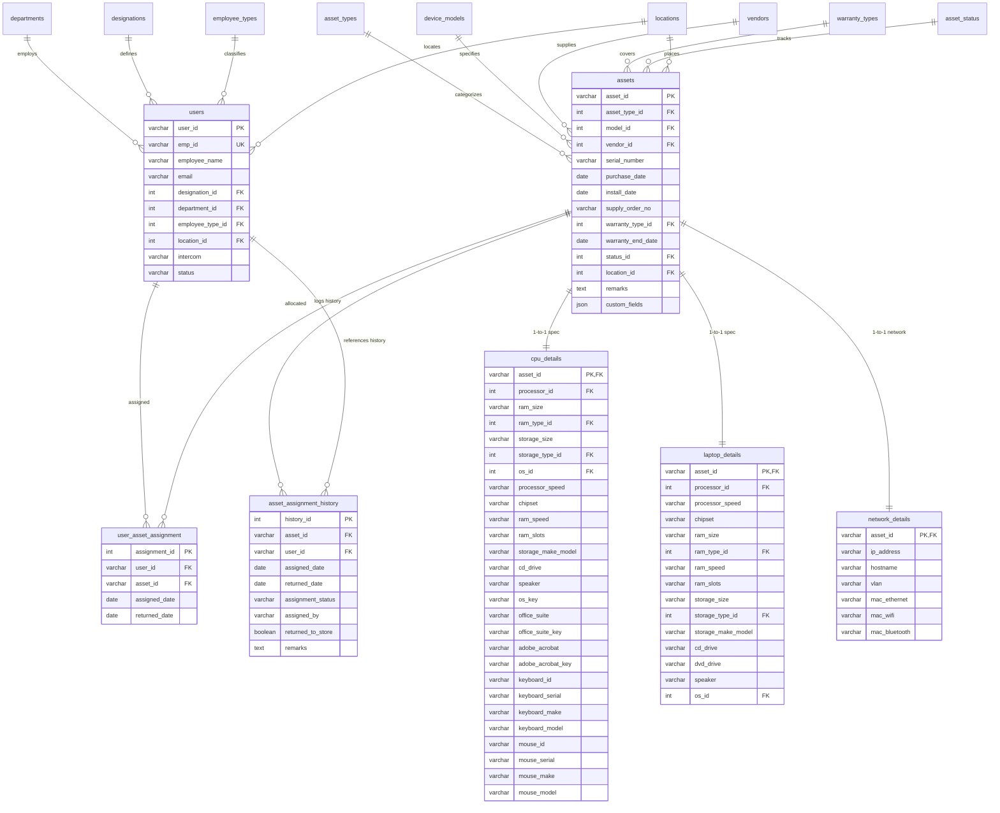

# AAI IT Asset Management System

An enterprise-grade IT Asset Management System developed for the **Airports Authority of India (AAI)** to manage, track, and audit organizational IT hardware, network resources, software licenses, and employee assignments through a centralized dashboard.

---

## 🛠️ Technology Stack

| Component | Technology | Description |
| :--- | :--- | :--- |
| **Frontend** | React (TypeScript) + Vite | Fast, modern SPA framework with strict typing. |
| **Styling** | Tailwind CSS + Shadcn UI | Premium, clean layout with dark mode support. |
| **Routing** | TanStack Router | Type-safe declarative client-side routing. |
| **Backend** | Node.js + Express.js | Lightweight REST API server. |
| **Database** | MySQL (3NF Normalized) | Relational database utilizing a connection pool. |
| **Authentication** | JSON Web Tokens (JWT) | Secure token-based auth with bcrypt-hashed passwords. |

---

## 📐 System Architecture

The application implements a decoupled **Client-Server-Database** architecture:

```mermaid
graph TD
    subgraph Client (Vite + React SPA)
        UI[User Interface Components]
        TSR[TanStack Router]
        AuthC[Auth Context]
        AxiosC[Axios API Client]
    end

    subgraph Server (Express.js API)
        AuthM[Auth Middleware]
        Routes[API Routes]
        Controllers[API Controllers]
        DBPool[MySQL Connection Pool]
    end

    subgraph Database (MySQL)
        Schema[(3NF Database)]
    end

    UI --> TSR
    UI --> AuthC
    AuthC --> AxiosC
    AxiosC -- Protected HTTP Request (JWT) --> AuthM
    AuthM --> Routes
    Routes --> Controllers
    Controllers --> DBPool
    DBPool --> Schema
```

---

## 🗄️ Database Design (Entity-Relationship Diagram)

The database schema is strictly normalized in **Third Normal Form (3NF)** to guarantee data integrity, eliminate redundancy, and ensure high query performance via database indexes.



### Key Normalization Practices in the Schema:
1. **Dynamic Extension via details Tables**: Rather than polluting the core `assets` table with specific configurations (like RAM speed or OS versions), those are stored in secondary 1-to-1 tables (`cpu_details`, `laptop_details`, `network_details`).
2. **Lookup Tables**: Attributes like `brands`, `device_models`, `locations`, `departments`, and `asset_status` are fully isolated into relational reference tables to avoid duplicate entries and typos.
3. **Audit Trail Logs**: The `asset_assignment_history` table keeps a permanent record of all current and historical assignments, noting parameters like returned status and active admins.

---

## 📂 Codebase File Directory Explanation

Here is a breakdown of the key files in the repository:

### 📂 Root Directory
* [package.json](file:///c:/Users/HP/OneDrive/ドキュメント/Front-end/Projects/AAI/final/package.json) - Defines project details, scripts, and dev dependencies for the Vite frontend framework.
* [vite.config.ts](file:///c:/Users/HP/OneDrive/ドキュメント/Front-end/Projects/AAI/final/vite.config.ts) - Configuration for Vite (uses tailwind, react plugins, and configures paths).
* [tsconfig.json](file:///c:/Users/HP/OneDrive/ドキュメント/Front-end/Projects/AAI/final/tsconfig.json) - Strict TypeScript Compiler configuration.
* [components.json](file:///c:/Users/HP/OneDrive/ドキュメント/Front-end/Projects/AAI/final/components.json) - Radix UI / Shadcn layout installer schema.

---

### 📂 Backend Server (`/server`)
Responsible for SQL query management, API endpoints, user authentication, and data integrity transactions.

* [server.js](file:///c:/Users/HP/OneDrive/ドキュメント/Front-end/Projects/AAI/final/server/server.js) - Entry point of the Express API. Binds routing prefixes, parses JSON payloads, handles CORS policies, and runs the listener.
* [db.js](file:///c:/Users/HP/OneDrive/ドキュメント/Front-end/Projects/AAI/final/server/db.js) - Creates a MySQL connection pool using properties loaded from the `.env` configuration.
* [init-db.js](file:///c:/Users/HP/OneDrive/ドキュメント/Front-end/Projects/AAI/final/server/init-db.js) - Executes `schema.sql` and `seed.sql` to initialize database structures and populate reference values.
* [seed-dummy.js](file:///c:/Users/HP/OneDrive/ドキュメント/Front-end/Projects/AAI/final/server/seed-dummy.js) - Seeds the database with sandbox records (test assets, users, and locations) for testing purposes.
* [schema.sql](file:///c:/Users/HP/OneDrive/ドキュメント/Front-end/Projects/AAI/final/server/schema.sql) - The schema source definition for tables, foreign keys, and indexes.
* [seed.sql](file:///c:/Users/HP/OneDrive/ドキュメント/Front-end/Projects/AAI/final/server/seed.sql) - Initial data insert commands for lookups (like departments, statuses, designations).
* **`📂 routes/`** - Maps specific HTTP request methods and paths to controller modules.
  * [auth.js](file:///c:/Users/HP/OneDrive/ドキュメント/Front-end/Projects/AAI/final/server/routes/auth.js) - Registration, logins, and password adjustment routes.
  * [assets.js](file:///c:/Users/HP/OneDrive/ドキュメント/Front-end/Projects/AAI/final/server/routes/assets.js) - Asset collection and asset creation endpoints.
  * [users.js](file:///c:/Users/HP/OneDrive/ドキュメント/Front-end/Projects/AAI/final/server/routes/users.js) - Employee profiles routes.
  * [assignments.js](file:///c:/Users/HP/OneDrive/ドキュメント/Front-end/Projects/AAI/final/server/routes/assignments.js) - Asset assignment and release routes.
  * [masters.js](file:///c:/Users/HP/OneDrive/ドキュメント/Front-end/Projects/AAI/final/server/routes/masters.js) - Master lookup reference tables endpoints.
  * [withdrawals.js](file:///c:/Users/HP/OneDrive/ドキュメント/Front-end/Projects/AAI/final/server/routes/withdrawals.js) - Asset handover/withdrawal records routes.
* **`📂 controllers/`** - Houses pure business logic, database queries, and parameters extraction.
  * [assetsController.js](file:///c:/Users/HP/OneDrive/ドキュメント/Front-end/Projects/AAI/final/server/controllers/assetsController.js) - Implements asset search, dynamic hardware specs insertions, updates, and assignment logs. Incorporates database transactions to guarantee rollbacks during complex queries.
  * [usersController.js](file:///c:/Users/HP/OneDrive/ドキュメント/Front-end/Projects/AAI/final/server/controllers/usersController.js) - Implements employee CRUD actions and lists individual assigned inventory.
  * [assignmentsController.js](file:///c:/Users/HP/OneDrive/ドキュメント/Front-end/Projects/AAI/final/server/controllers/assignmentsController.js) - Logic for updating assignment dates, setting returned flags, and appending history entries.
  * [dashboardController.js](file:///c:/Users/HP/OneDrive/ドキュメント/Front-end/Projects/AAI/final/server/controllers/dashboardController.js) - Aggregate indicators (total assets count, warranty expiries, status counts).
* **`📂 middleware/`** - Custom filter layers.
  * [auth.js](file:///c:/Users/HP/OneDrive/ドキュメント/Front-end/Projects/AAI/final/server/middleware/auth.js) - JWT interceptor validating the request's Authorization header using a secret key.

---

### 📂 Frontend Application (`/src`)
Responsible for routing, state tracking, styling, forms validation, and dynamic client screens.

* [router.tsx](file:///c:/Users/HP/OneDrive/ドキュメント/Front-end/Projects/AAI/final/src/router.tsx) - Initializes TanStack Router.
* [server.ts](file:///c:/Users/HP/OneDrive/ドキュメント/Front-end/Projects/AAI/final/src/server.ts) & [start.ts](file:///c:/Users/HP/OneDrive/ドキュメント/Front-end/Projects/AAI/final/src/start.ts) - Integrates the frontend SPA server config.
* [styles.css](file:///c:/Users/HP/OneDrive/ドキュメント/Front-end/Projects/AAI/final/src/styles.css) - Global stylesheets, custom Tailwind utility classes, and layout variables.
* **`📂 lib/`** - Central utilities.
  * [api.ts](file:///c:/Users/HP/OneDrive/ドキュメント/Front-end/Projects/AAI/final/src/lib/api.ts) - Creates an Axios instance referencing the `/api` backend. Automatically appends the user's stored JWT token to the request headers.
  * [auth-context.tsx](file:///c:/Users/HP/OneDrive/ドキュメント/Front-end/Projects/AAI/final/src/lib/auth-context.tsx) - Manages application-wide user sessions, login state, and credentials persistence in `localStorage`.
* **`📂 components/`** - Reusable UI widgets.
  * [app-layout.tsx](file:///c:/Users/HP/OneDrive/ドキュメント/Front-end/Projects/AAI/final/src/components/app-layout.tsx) - Core navigation container with responsive sidebar, notifications alert list, global search, and dark mode toggle.
  * [asset-form-dialog.tsx](file:///c:/Users/HP/OneDrive/ドキュメント/Front-end/Projects/AAI/final/src/components/asset-form-dialog.tsx) - Modal displaying a form to create/edit hardware details. Dynamically alters form fields (e.g. CPU fields, RAM size, disk type, or capacity specs) based on the chosen asset type.
  * [user-form-dialog.tsx](file:///c:/Users/HP/OneDrive/ドキュメント/Front-end/Projects/AAI/final/src/components/user-form-dialog.tsx) - Form dialog to add/edit employee details.
* **`📂 routes/`** - Pages mapped via TanStack Router.
  * [index.tsx](file:///c:/Users/HP/OneDrive/ドキュメント/Front-end/Projects/AAI/final/src/routes/index.tsx) - Landing/Login portal.
  * [_app.tsx](file:///c:/Users/HP/OneDrive/ドキュメント/Front-end/Projects/AAI/final/src/routes/_app.tsx) - Layout Wrapper enforcing authentication on sub-routes.
  * [_app.dashboard.tsx](file:///c:/Users/HP/OneDrive/ドキュメント/Front-end/Projects/AAI/final/src/routes/_app.dashboard.tsx) - Analytical summaries, warranty widgets, and department/location asset distributions.
  * [_app.assets.index.tsx](file:///c:/Users/HP/OneDrive/ドキュメント/Front-end/Projects/AAI/final/src/routes/_app.assets.index.tsx) - Listing view for all hardware assets with search/filters.
  * [_app.assets.$id.tsx](file:///c:/Users/HP/OneDrive/ドキュメント/Front-end/Projects/AAI/final/src/routes/_app.assets.$id.tsx) - Comprehensive detailed record sheet for a single asset, showing history log, hardware/network specifications, and actions.
  * [_app.assignments.tsx](file:///c:/Users/HP/OneDrive/ドキュメント/Front-end/Projects/AAI/final/src/routes/_app.assignments.tsx) - Assignment wizard for allocating, returning, and tracking devices.
  * [_app.network.tsx](file:///c:/Users/HP/OneDrive/ドキュメント/Front-end/Projects/AAI/final/src/routes/_app.network.tsx) - Hostnames, VLANs, and IP configuration dashboard.
  * [_app.withdrawals.tsx](file:///c:/Users/HP/OneDrive/ドキュメント/Front-end/Projects/AAI/final/src/routes/_app.withdrawals.tsx) - Asset handover forms and record logs for employee exit clearance.

---

## 🏃 Getting Started & Running Locally

### 1. Prerequisites
Ensure you have the following installed:
* Node.js (version 18+)
* MySQL Server (running locally or remotely)

### 2. Database Environment Configuration
Create a `.env` file inside the `server/` directory:
```env
PORT=5000
DB_HOST=localhost
DB_USER=root
DB_PASSWORD=YourPassword Here
DB_NAME=aai_asset
JWT_SECRET=super_secret_key_for_aai_management
```

### 3. Initialize & Seed Database
Navigate to the `server/` folder and execute the migration/seed scripts:
```powershell
cd server
npm install
node init-db.js      # Creates tables and inserts master data
node seed-dummy.js   # Inserts mock sandbox records
```

### 4. Run the Backend API Server
Start the Express server:
```powershell
npm start            # Runs node server.js
```

### 5. Run the Frontend Client Application
Navigate to the project root in a new terminal window:
```powershell
npm install
npm run dev          # Starts the Vite development server (usually http://localhost:5173)
```

---

## 🔄 Core Business Workflows

### 🛡️ Secure Authenticated Routing
1. When a user submits username/password at `/` ([index.tsx](file:///c:/Users/HP/OneDrive/ドキュメント/Front-end/Projects/AAI/final/src/routes/index.tsx)), the frontend issues a POST to `/api/auth/login`.
2. The server authenticates credentials against `app_users`, and responds with a JWT token.
3. The client stores the JWT in `localStorage` via the `AuthContext` ([auth-context.tsx](file:///c:/Users/HP/OneDrive/ドキュメント/Front-end/Projects/AAI/final/src/lib/auth-context.tsx)).
4. Any requests made through the Axios client ([api.ts](file:///c:/Users/HP/OneDrive/ドキュメント/Front-end/Projects/AAI/final/src/lib/api.ts)) intercept the call and inject the `Authorization: Bearer <token>` header.
5. In TanStack Router, the `_app` route checks context status. Unauthenticated requests are immediately redirected back to `/`.

### 💻 Dynamic Specifications Form Logic
Different IT hardware assets require tracking different physical properties (e.g., desktops need RAM slots and mouse IDs, network switches need VLANs, UPS units need capacities).
1. When creating/editing an asset in [asset-form-dialog.tsx](file:///c:/Users/HP/OneDrive/ドキュメント/Front-end/Projects/AAI/final/src/components/asset-form-dialog.tsx), selecting an **Asset Type** triggers a layout render change.
2. If `Desktop CPU` or `Laptop` is chosen, specifications forms render RAM/Storage/OS attributes.
3. If `Switch` or `UPS` is chosen, the generic capacity input is displayed.
4. When saved, the controller ([assetsController.js](file:///c:/Users/HP/OneDrive/ドキュメント/Front-end/Projects/AAI/final/server/controllers/assetsController.js)) utilizes transactional queries to write to the core `assets` table, then dynamically redirects specific specs blocks to `cpu_details`, `laptop_details`, or `equipment_specs` tables.

### 📝 Asset Assignment & Release Tracking
To allocate a device:
1. In the **Assignments** screen ([_app.assignments.tsx](file:///c:/Users/HP/OneDrive/ドキュメント/Front-end/Projects/AAI/final/src/routes/_app.assignments.tsx)), you select a target employee and a list of available assets.
2. The backend inserts a record into `user_asset_assignment` with `returned_date = NULL`, sets the asset status to `Assigned`, and writes to `asset_assignment_history` to log the timestamp and managing admin.
3. To return/release the asset, the `returned_date` column in `user_asset_assignment` is updated to the current time, liberating the asset status back to `Available`.
